[Back to workshop overview](../README.md)

# Part 2
# Integrate with 3scale to add API management features


## Table of Contents

* 0) Prerequisites for this tutorial ([Jump to section](#prerequisites))
* 1) Goals of this tutorial ([Jump to section](#goals))
* 2) (Optional) Create an API and deployed it to Amazon API gateway ([Jump to section](#lambda-api))
* 3) Deploy the stack of AWS services ([Jump to section](#deploy-project))
* 4) Add 3scale custom authorizer to Amazon API Gateway ([Jump to section](#deploy))
* 5) Testing the whole flow end-to-end ([Jump to section](#testing))
* Additional resources
	* Intro to [3scale](https://www.3scale.net/) API Management ([Jump to section](#intro))
	* Intro to the Amazon API Gateway [custom authorizer](http://docs.aws.amazon.com/apigateway/latest/developerguide/use-custom-authorizer.html#api-gateway-custom-authorization-overview) principles ([Jump to section](#authorizer))
	* Async mechanism using SNS ([Jump to section](#sns))

<a name="prerequisites"></a>
## 0) Prerequisites for this tutorial
* 3scale account -- sign up at [3scale.net](https://www.3scale.net/aws-loft/ )
* AWS account -- sign up at [aws.amazon.com](http://aws.amazon.com)
* AWS command line interface (CLI) installed locally -- ([Instructions](http://docs.aws.amazon.com/cli/latest/userguide/cli-chap-welcome.html))
* Node.js environment installed locally -- ([Instructions](https://docs.npmjs.com/getting-started/installing-node))
* Serverless framework installed locally -- ([Instructions](https://github.com/serverless/serverless))


<a name="goals"></a>
## 1) Goals of this tutorial
You've seen the importance of API management when you are developing and exposing APIs. In this tutorial we will show how to add an API management layer to your existing API.

For this tutorial you will use:

* Amazon API Gateway: for basic API traffic management
* AWS Lambda: for implementing the logic behind your API
* Elasticache: for caching API keys and improving performance
* VPC: for connecting AWS Lambda with Elasticache
* Serverless framework: for making configuration and deployment to Lambda a lot easier
* 3scale API management platform for API contracts on tiered application plans, monetization, and developer portals with interactive API documentation

Below are two overview diagrams that describe the various components involved and their interactions. The first diagram shows what happens when a certain API endpoint is called for the first time togehter with a certain API key.

<a name="firstcall"></a>


Here is the flow for the first call:

1. Amazon API Gateway checks the 3scale custom authorizer if this call is authorized.
2. The 3scale custom authorizer checks if the authorization info is stored in the cache.
3. Since it is the first call, there is no info stored in the cache. So, the 3scale custom authorizer queries the 3scale API Management platform, which returns whether this call is authorized or not.
4. The 3scale custom authorizer updates the cache accordingly.
5. The 3scale custom authorizer returns the authorization response to the Amazon API Gateway.
6. If the call was positively authorized, the Amazon API Gateway directly queries the API backend, which in our case is a Lambda function.

The second diagram below shows what happens at every subsequent request to the same  API endpoint with the same API key.

<a name="subsequentcalls"></a>


Here is the flow for every subsequent call:

1. Amazon API Gateway checks the 3scale custom authorizer if this call is authorized.
2. The 3scale custom authorizer checks if the authorization info is stored in the cache. Since other calls have previously been executed, the cache has the authorization info stored.
3. The 3scale custom authorizer returns the authorization response to the Amazon API Gateway.
4. If the call was positively authorized, the Amazon API Gateway directly queries the API backend, which in our case is a Lambda function.
5. The 3scale custom authorizer calls the 3scale Async Reporting Function.
6. The 3scale Async Reporting Function reports the traffic back to the 3scale API Management platform, which is used for API analytics.

<a name="lambda-api"></a>
## 2) (Optional) Create an API and deployed it to Amazon API gateway
If you don't yet have an API deployed on Amazon API gateway you can create one very easily using the [Serverless](https://github.com/serverless/serverless) framework. `sls` is the Serverless CLI which you should have installed on your system as part of the prerequisites of this tutorial.

Follow the following steps:

1. Create a project: `sls project create`, let's call it `sls-awstutorial` 
This step is taking few minutes.
2. Move into the new created folder `cd sls-awstutorial`
3. Create an endpoint: `sls function create greetings` (This will create a `greetings` folder.)
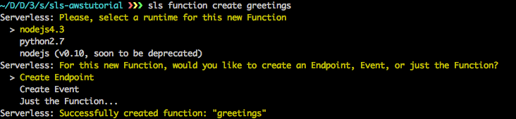
4. Move to the `greetings` folder `cd greetings`
5. You can test this endpoint with the command:  `sls function run`.
You should see the following result
```
{
	"message": "Go Serverless! Your Lambda function executed successfully!"
}
```
This is what we will returned by our API endpoint.
6. Finally deploy this endpoint using: `sls dash deploy`
Select both the endpoint and the function.
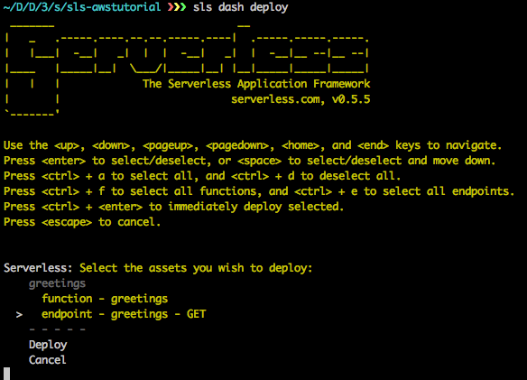

If it succeeded it should give you the URL of the API created.
We will use this API during the rest of our tutorial.

<a name="deploy-project"></a>
## 3) Deploy stack
For this integration we are going to use a lot of different services from the AWS stack.

To simplify the deployment and the linking of this stack we are going to use CloudFormation.

If you are not familiar with CloudFormation, it's an AWS service that let you describe in a JSON file all the AWS services you want to use and link them together. [Read more about cloudformation](http://aws.amazon.com/cloudformation/)

We also bundled the CloudFormation stack into our Serverless project, so the Lambda functions could also take advantage of CloudFormation.

The Lambda functions will call the 3scale API Management platform to check if a call to the API is authorized.

We are using the Serverless framework, which is a great way to deploy Lambda functions easily. If you are not familiar with it, check their [site](http://serverless.com). It's basically a tool that helps you manage Lambda functions easily.

Follow these steps to deploy the 3scale stack:

1. Clone [this repo](https://github.com/picsoung/awsThreeScale_Authorizer) locally using the following commands:
	```
	git clone https://github.com/picsoung/awsThreeScale_Authorizer
	cd awsThreeScale_Authorizer
	```

2. In the `awsThreeScale_Authorizer` folder you will see two different folders, which represent the two Lambda function we are going to use:
    * `authorizer` is the Lambda function that is called by the Amazon API Gateway to authorize incoming API calls (see the [first diagram above](#firstcall)).
    * `authrepAsync` is called by the `authorizer` function to sync with the 3scale API Management platform for API traffic reporting and analytics (see the [second diagram above](#subsequentcalls)).
    
To check the CloudFormation settings you can look at `s-ressources-cf.json` file at the root of the project.

Before deploying this to AWS we need to complete a few more tasks.

1. Init serverless project in your project's root folder with 

```
npm install
sls project init
```
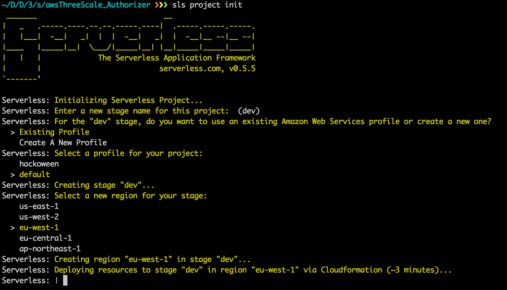

This will install all the npm modules we need to run our functions. And it will setup the serverless project, asking for a stage and a region where to deploy it.

2. The logic of each Lambda function is kept in the `handler.js` file but we don't have to touch it. If you look at the code in this file you will see that we are using environment variables. So, let's set them up:

  1. Go to the `authorizer` folder
  2. Modify the placeholder `YOUR_3SCALE_PROVIDER_KEY` and `YOUR_3SCALE_SERVICE_ID`  with your own values under `environment` section.

```
"environment": {
	"SERVERLESS_PROJECT": "${project}",
	"SERVERLESS_STAGE": "${stage}",
	"SERVERLESS_REGION": "${region}",
	"THREESCALE_PROVIDER_KEY": "YOUR_3SCALE_PROVIDER_KEY",
	"THREESCALE_SERVICE_ID": "YOUR_3SCALE_SERVICE_ID",
	"ELASTICACHE_ENDPOINT": "${elastiCacheEndpoint}",
	"ELASTICACHE_PORT": 6379,
  "SNS_TOPIC_ARN":"${snsTopic}"
}
```

You can find `YOUR_3SCALE_PROVIDER_KEY` under `Accounts` tab in your 3scale account on the 3scale portal.

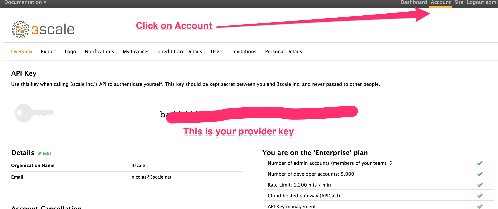

You can find `YOUR_3SCALE_SERVICE_ID` under the `APIs` tab.

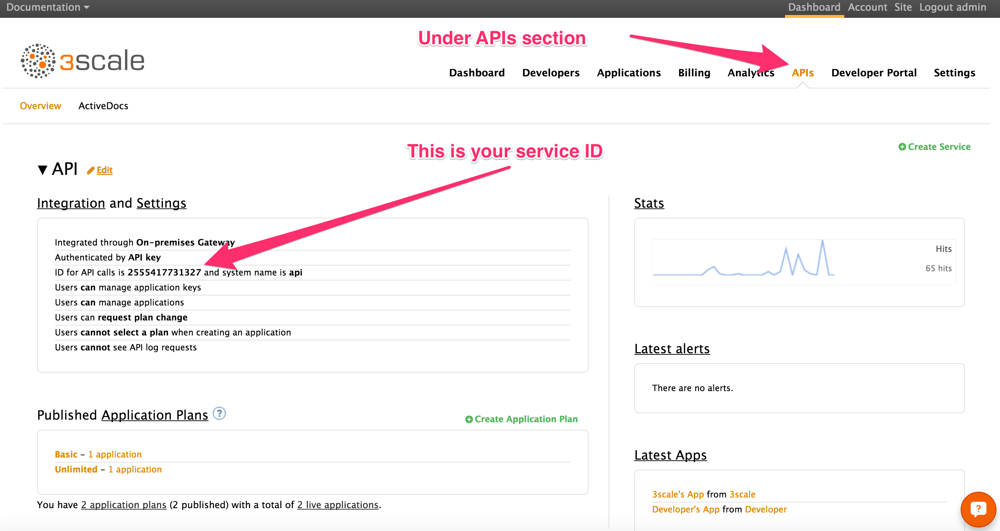

We don't need to change anything in this file. The other environment variables will be populated by Serverless and CloudFormation.

  3. Repeat the same steps for the `s-function.json` file in the `authrepSync` folder too.

  4. Finally, redeploy your function and resources:
```
	sls resources deploy
	sls dash deploy
```
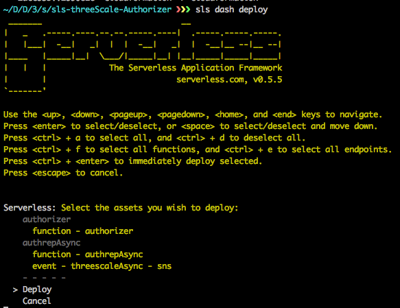

The first command may take a while as it's deploying all the AWS services.

If everything went well, you are done with the coding part, you are ready to use 3scale Management tool on your API.

<a name="deploy"></a>
## 4) Add 3scale custom authorizer to Amazon API Gateway
We are now going to add the custom authorizer functions we just deployed to our existing API on the Amazon API Gateway.

To do so follow these steps:

1. Go to the Amazon API Gateway console and select your API.
2. You should see a section named `Custom Authorizers` in the menu on the left hand side. Click on it.
3. Click on the `Create` button to create your custom authorizer.
4. Name it `threescale`.
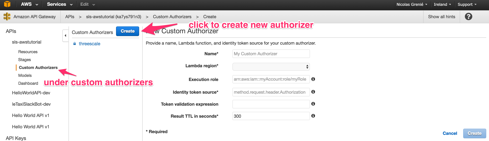
5. Choose the region where your Lambda has been deployed
6. For the `Lambda function` field, look for and choose the authorizer function you have deployed earlier. (Just start typing and it should appear: `sls-threeScale-Authorizer-authorizer`)
7. Under `Identify token source` modify it to `method.request.header.apikey`. It means that we are expecting developers to make a call to our API with a header `apikey`, and we will use this key to authenticate the request.
8. Finally change TTL to 0.

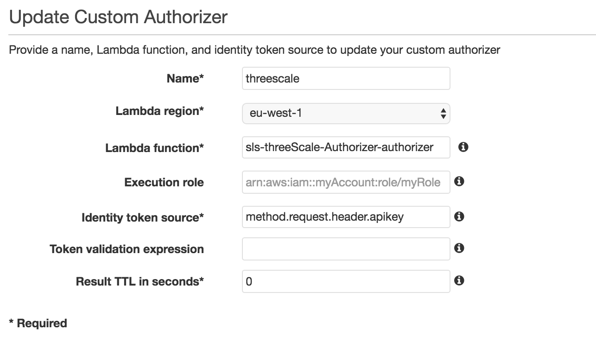

We now have a custom authorizer, which is already handling caching.

Finally, we have to apply it to our API endpoints:

1. Go to the `Resources` part of your API.
2. Select a method, and click on the `method request` box.
3. Change `Authorization` to the `threescale` custom authorizer you have created before and save.
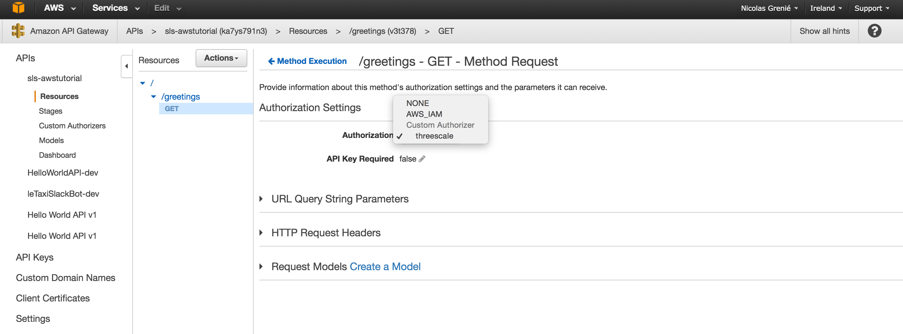
4. Finally, re-deploy your API by clicking on the `Actions` button and then select `Deploy API` at the bottom.

You would have to reproduce these steps on each endpoint of your API to make sure all your API is secured. But for now we can limit it to a single endpoint.

<a name="testing"></a>
## 5) Testing the whole flow end-to-end

You are almost done!

Now let's test if everything worked fine:

1. Go to your 3scale account on the 3scale portal.
2. Take a valid API key. Anyone would do. Once you are logged in to your 3scale account go to the `Applications` section.
3. Click on the default application.
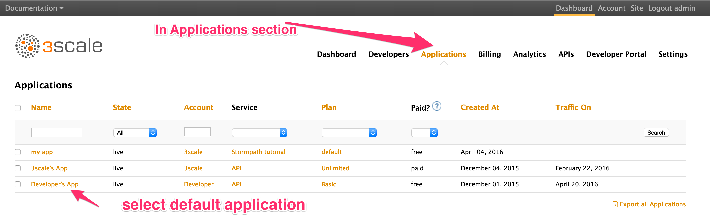
4. On the next screen you see details about this application like what plan it is associated with, or the traffic over the last 30 days. We can look at those features later, now we are only interested in the `User Key`. Copy it.
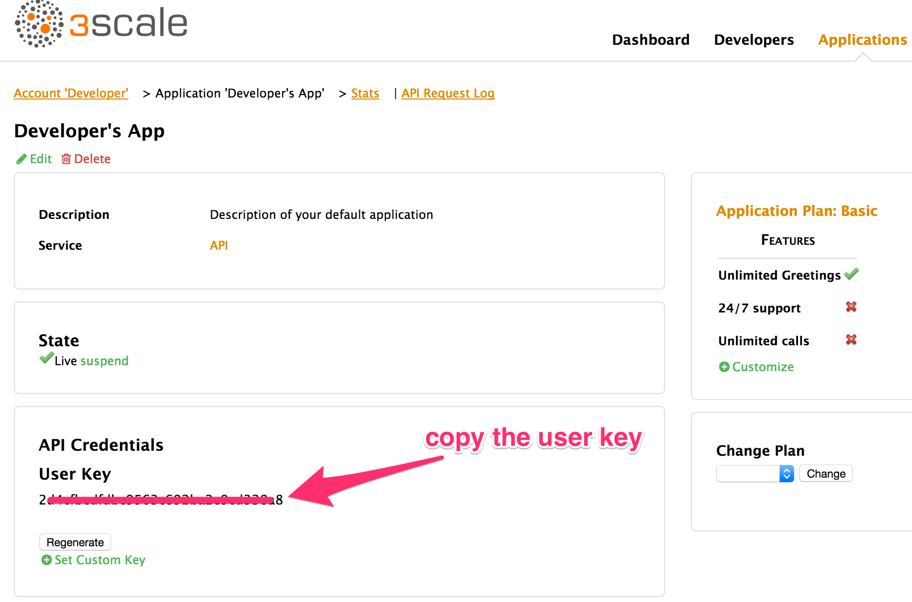

Finally, to test the whole API flow end-to-end including authorization via custom authorizer and 3scale API Management platform, we make a call to your API endpoint and include the API key as a header.

To do that, open a terminal and run the following command (alternatively you could also use a client like [Postman](https://www.getpostman.com/)):

```
curl -X http://YOUR_API_GATEWAY_URL/YOURENDPOINT \
	-H 'apikey: 3SCALE_API_KEY'
```

If we did it all correctly, then you will see the result of your API call returned.

Now let's try with a non valid Key. Simply replace the API key with any random string. Hit the endpoint again. See? It does not work. The call is not authorized and an error response is returned.

Your API is now protected and only accessible to people with a valid API key.

--- 

# Additional resources

<a name="intro"></a>
## Intro to 3scale API Management
3scale makes it easy to open, secure, manage, distribute, control, and monetize your APIs. Built with performance, customer control and excellent time-to-value in mind, no other solution gives API providers so much power, ease, flexibility and scalability in such a cost effective way. Check it out at https://www.3scale.net

3scale’s API Management Platform also supports the unique requirements of delivering APIs on the Amazon Web Services (AWS) infrastructure stack -- fexibly, at scale and with great RoI. API providers on AWS don’t have to switch solutions to get Amazon API gateway features like distributed denial-of-service (DDoS) attack protection, caching and logging. Plus, adding 3scale provides rich, sophisticated API management business operations for fine-grained API control and visibility, as well as features for API adoption and promotion. Check out the details about this [integrated solution](https://www.3scale.net/amazon-gateway-integration/).

<a name="principles"></a>
## Intro to the Amazon API Gateway custom authorizer principles
With the Amazon API Gateway custom authorizer, you can control access to your APIs using bearer token authentication strategies, such as OAuth or SAML. To do so, you provide and configure a custom authorizer (basically your own Lambda function) for the Amazon API Gateway, which is then used to authorize the client requests for the configured APIs. You can find all the details how to do this in a dedicated Amazon API Gateway [tutorial](http://docs.aws.amazon.com/apigateway/latest/developerguide/use-custom-authorizer.html).

<a name="sns"></a>
## Async mechanism using Amazon Simple Notification Service
The 3scale custom authorizer function will be called every time a request comes in to the Amazon API Gateway. It is inefficient to call the 3scale API Management platform every time to check if a certain API key is authorized or not.

That's where Elasticache comes in handy.

We implemented the logic of our custom authorizer such that the first time we see an API key we will ask 3scale to authorize it. We then store the result in cache so we can serve it next time the same API key is making another call.

In the case of all the subsequent calls we use the `authRepAsync` Lambda function to sync the cache with the 3scale API Management platform.

This `authRepAsync` function is called by the main `authorizer` function using the [Amazon Simple Notification Service](https://aws.amazon.com/sns/) (SNS). SNS is a notifications protocol available on AWS. A Lambda function can subscribe to a specific topic. Every time a message related to this topic is sent, the Lambda function is triggered.

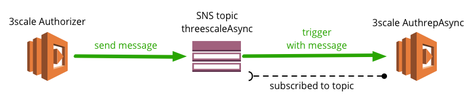


[Back to workshop overview](../README.md)
