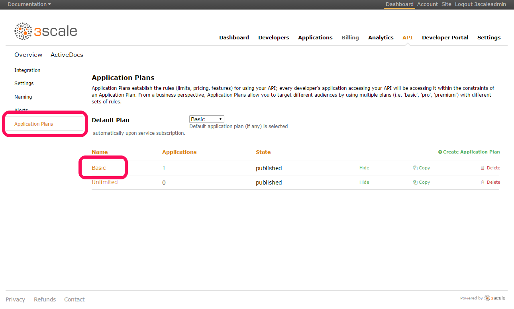
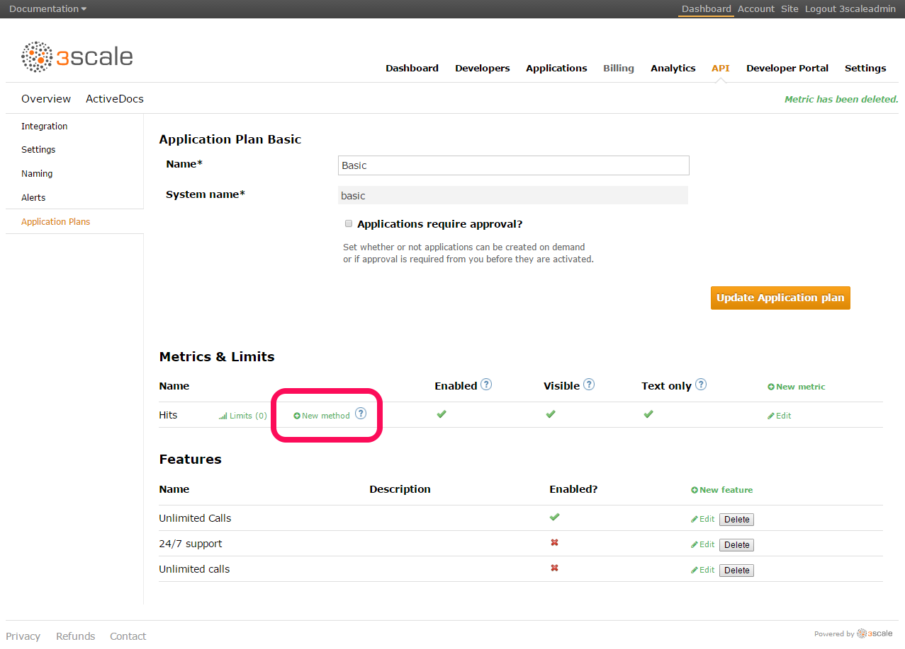
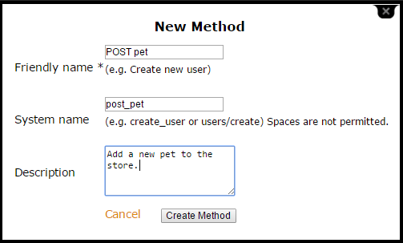
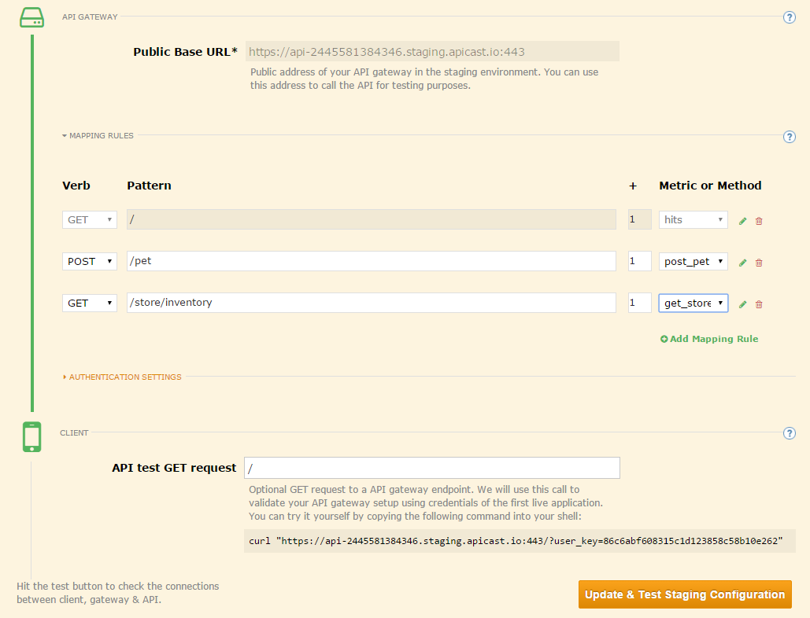

[Back to workshop overview](../README.md)

# Part 3
# Create tiered application plans with different API contracts

In this part of the tutorial we show how to use the 3scale API Management platform to configure fine-grained API contracts using tiered application plans. 

## Table of Contents
* Mapping API endpoints in 3scale
* Creating and configuring application plans
* Exploring API endpoints in API analytics
* Summary of what we achieved
* Further resources

## Mapping API endpoints in 3scale
After you have completed [Part 2](Part2--APImanagement.md) of this workshop, you have set up a basic connection between the Amazon API Gateway and the 3scale API Management platform for API call authorization and reporting. Now we want to fine-tune this and will start by mapping the various API endpoints into 3scale. The benefit of this is that you can then manage and control each endpoint individually.

For the workshop we use the classic [petstore](http://petstore.swagger.io/) example. You can also check out the [swagger.json](http://petstore.swagger.io/v2/swagger.json) file that represents the various petstore API endpoints. This example has a total of three resources and 19 endpoints.  

In order to map those into 3scale follow these steps:
1. Log in to your 3scale account.
2. On the main dashboard click the `API` tab. 
3. Click `Integration` on the left hand side. This screen shows you the basic information about the integration with the Amazon API Gateway such as the base URL.
4. Next click on `Application Plans` in the navigation pane on the left hand side, and then choose `Basic Plan` in the middle. 

5. On the next screen you can see the various configurable methods and metrics, which we later map onto API endpoints. Initially we have no method for the specific petstore endpoints. So, let's create some. Click on `New method`. 

6. In the dialog box, let us create a method that we can later map to the `POST /pet` API endpoint.

7. Let's add another method for the `GET /store/inventory` endpoint.
8. After that you should see the two methods in your portal (see screenshot below). You can carry on an create methods for all the other endpoints too. But for the simplicity of this tutorial we carry on with just two at the moment.

9. Next we go back to the `Integration` page from the navigation bar on the left hand side. 
10. In the middle section you will see `Mapping Rules`. Unfold them. You will see that there are not mapping rules defined yet. 
11. Click on `Add Mapping Rule`.
12. Let's first map our `POST /pet` method, which we created earlier, to the corresponding API endpoint of the petstore API.
13. Choose `POST` as the verb. Add `/pet` as the relative endpoint URL. And choose our corresponding method from the dropdown list which is `post_pet`.
14. Go ahead and do the same for all the other methods you created earlier. In our case, we made another one for `GET /store/inventory`. When done your portal will show the mapping rules something like this:

15. Finally click `Update & Test Staging Configuration` to confirm the changes and run a simple test.

After you have completed these steps, you now have a very fine-grained way of managing and controlling every petstore API endpoint individually. 

As a next step, we want to configure different application plans on top of our managed API endpoints. Application plans are one of the key benefits of API management because they allow you to configure and provide different services and service levels to your different API consumer segments. 

## Creating and configuring application plans

[Application plans in 3scale](https://support.3scale.net/howtos/api-configuration#application-plans) define the different sets of access rights you might want to allow for consumers of your API. These can determine anything from rate limits, which methods or resources are accessible and which features are enabled. Let's see how we can achieve that on the 3scale API Management portal:

1. Log in to your 3scale account. You’ll see a dashboard of the most important performance figures for your API.  
2. Select the “API” tab from the navigation panel at the top. Then choose “Integration” on the left-hand side to start configuring your API management options.
`TODO: screenshot`
2. sdfsdf

## Exploring API endpoints in API analytics

## Summary of what we achieved

## Further resources
You can find a lot more detailed information about what you can do with 3scale’s rate limiting, analytics features, and application plans features on the [3scale Support](https://support.3scale.net/get-started/quickstarts/3scale-api-analytics) pages. 

[Back to workshop overview](../README.md)
