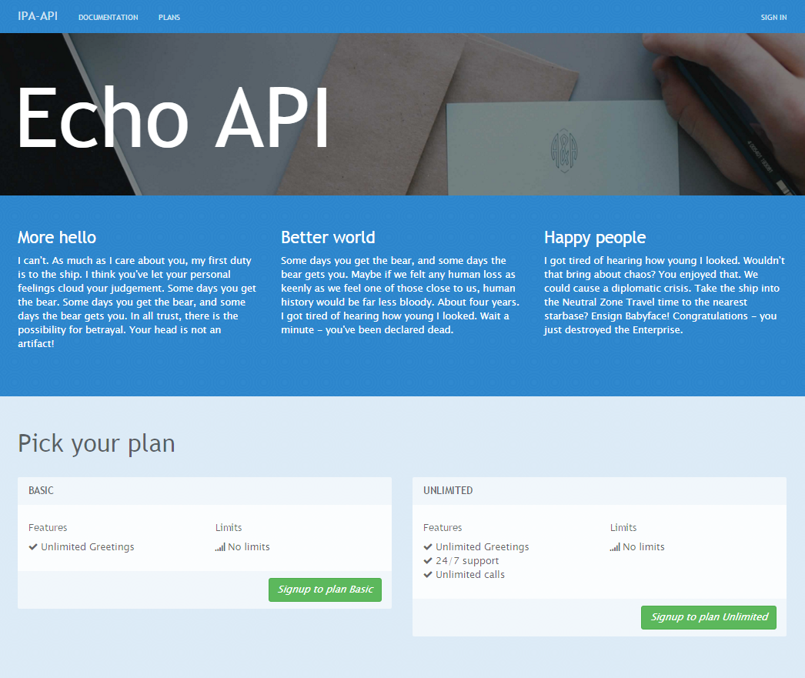
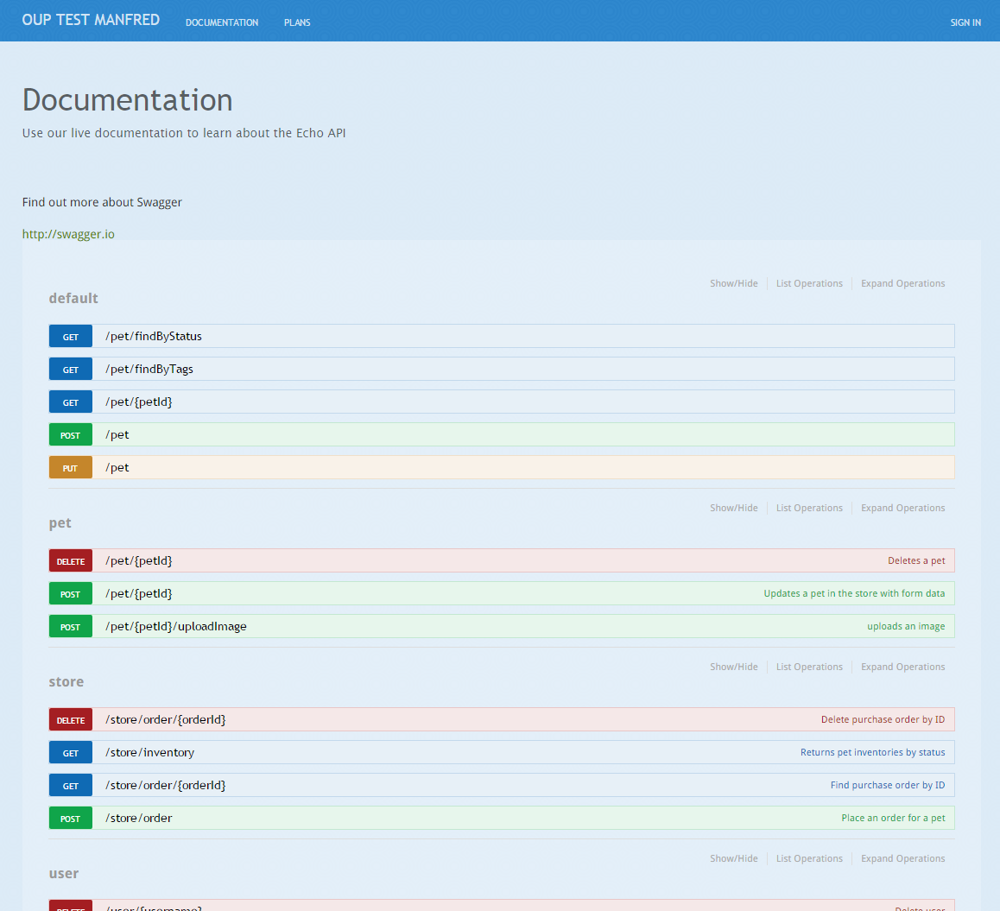

[Back to workshop overview](../README.md)

# Part 4
# Expose your API to developers with a developer portal and interactive API documentation

In this part of the tutorial we show how to use the 3scale API Management platform to configure a developer portal and expose your API to developers with this portal. We also introduce [interactive API documentation](https://www.3scale.net/api-management/interactive-api-documentation/) and show how to get this up and running. 

## Table of Contents
* Short intro to 3scale developer portals ([Jump to section](#intro))
* Basic configuration of developer portals
* Configure interactive API documentation
* Summary of what we achieved
* Further resources

## Short intro to 3scale developer portals
The 3scale API Management platform includes a ready-made [developer portal](https://www.3scale.net/api-management/api-developer-portal/), which supports all your necessary onboarding processes and can be fully customized to your brand specifications. It provides interactive API documentation based on the Swagger framework, which helps increase adoption by allowing developers to get to know your API before they even write one line of code to integrate with it.

3scale developer portals provide the following features:

* Simple CMS that uses only standard Web technologies such as HTML, CSS and JavaScript.
* Swagger-based API descriptions
* Interactive API documentation
* Developer onboarding (configurable sign-up processes)
* App management and analytics for developers
* Forums
 
## Basic configuration of developer portals

In order to configure the 3scale developer portal follow these steps:

1. Log in to your 3scale account.
2. Click the `Developer Portal` tab at the top. On the following page you can see the basic structure of the developer portal configuration. 

The navigation pane on the left hand side shows the basic structure of the Web assets (in HTML, CSS and JavaScript). By default the developer portal is not publicly accessible but protected via a token. By clicking the `Open your Portal to the world` button in the middle you would open up the developer portal publicly. If you click the button `Visit Developer Portal` you will see how the unmodified default developer portal looks like: 

You will see if you make smaller changes in the HTML or CSS and safe it, this will take immediately effect on your developer portal. There is a lot of stuff that you can do to customize the developer portal. We would like refer to our comprehensive developer portal guide on the [3scale Support pages](https://support.3scale.net/howtos/portal-configuration).

The developer portal also exposes the various application plans that we configured earlier in [part 3](Part3--ApplicationPlans.md) of this tutorial. With this developer onboarding and signup is fully supported.

## Configure interactive API documentation
The 3scale developer portal offers an [interactive API documentation](https://www.3scale.net/api-management/interactive-api-documentation/) using Swagger-based API descriptions. Basically we can use the petstore's [swagger.json](http://petstore.swagger.io/v2/swagger.json) which we used throughout this workshop also to set up the interactive API documentation.

Here is what you have to do to set it up:

1. On your 3scale dashboard click on the `API` tab.
2. Click on `ActiveDocs` top left. ActiveDocs is the feature name that we use at 3scale for interactive API documentation.
3. Then click on `Edit` on the right hand side.
4. An editor page opens, that has a section in the middle with some standard json file. simply delete this json and insert the content of the [swagger.json](http://petstore.swagger.io/v2/swagger.json). 
5. Click `Update Service` at the bottom right.
6. On the next screen you will see the result, which is the interactive API documentation. You can actually use it to execute API calls that go to your live API. 

7. And by the way this same Swagger-based interactive API documentation is also automatically exposed to your developer portal:

## Summary of what we achieved
In this final part of the workshop we showed how the API can be exposed to developers. This is a great tool for developer marketing and to increase the adoption of the API. We also showed the inclusion of the Swagger-based interactive API documentation. 

## Further resources
For more information about how to modify and configure the developer portal, please refer to our comprehensive guide on the [3scale Support pages](https://support.3scale.net/howtos/portal-configuration).

[Back to workshop overview](../README.md)

