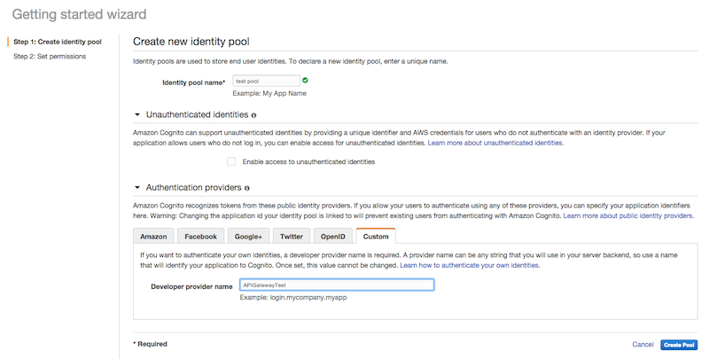
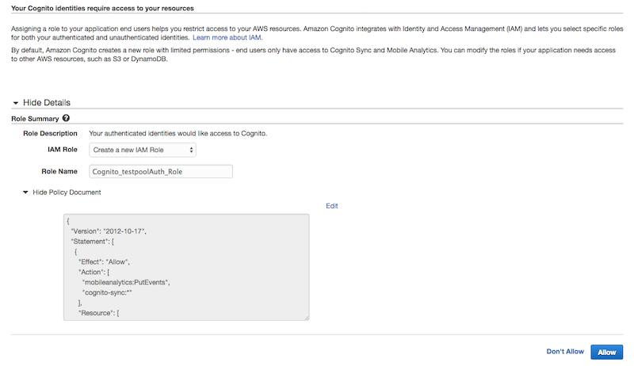
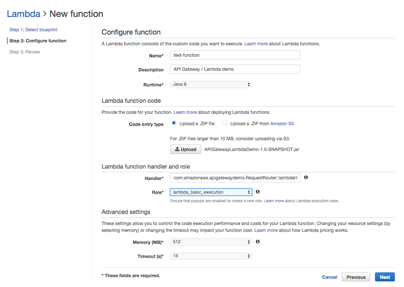

# Setup the Secure Pet Store

## Introduction
The Secure Pet Store sample is an application built in Java for [AWS Lambda](http://aws.amazon.com/lambda/). It uses [Amazon API Gateway](http://aws.amazon.com/api-gateway/) to expose the Lambda function as HTTP endpoints and uses Identity and Access Management (IAM) and [Amazon Cognito](http://aws.amazon.com/cognito/) to retrieve temporary credentials for a user and authorize access to its APIs with.

## The Secure Pet Store
* First, create an Amazon Cognito identity pool. The identity pool should only allow **Custom** authentication providers.
	
* The next step in the identity pool creation process sets up the IAM roles. For the time being simply click **Allow** to create the identity pool.
	
* Now that we have created the Cognito Identity Pool we need to setup the DynamoDB tables. The application requires 2 DynamoDB tables: one for the users and one for the pets. The annotated objects for users and pets are `com.amazonaws.apigatewaydemo.model.pet.Pet` and `com.amazonaws.apigatewaydemo.model.user.User` in the app source code.
 * The table for the users should have only a `Hash Key` of type `string` called **username**.
 * The pets table also has only a `Hash Key` of type `string` called **petId**.
* The next step is to configure the application to utilize the correct Cognito Identity Pool and DynamoDB tables. The app reads the configuration from static variables declared in the `CognitoConfiguration` and `DynamoDBConfiguration` in the `com.amazonaws.apigatewaydemo.configuration` package. Open the 2 classes and set the correct values on the properties.

| Class | Property | Description |
|-------|----------|-------------|
| CognitoConfiguration | IDENTITY_POOL_ID | The unique identifier for the Cognito Identity Pool. This values is available in the Amazon Cognito console. |
| CognitoConfiguration | CUSTOM_PROVIDER_NAME | The name of the developer provider specified during the Identity Pool creation process. You can access this value from the *edit identity pool* page. |
| DynamoDBConfiguration | USERS_TABLE_NAME | The name of the DynamoDB table created to store usernames and passwords |
| DynamoDBConfiguration | PET_TABLE_NAME | The name of the DynamoDB table created to store the pets |

* Now that the application is configured you can build it and package it for AWS Lambda using [Maven](https://maven.apache.org/). Open a terminal and navigate to the application folder, then run `mvn package`. This will create a *target* directory and inside it a file called `api-gateway-secure-pet-store-1.0-SNAPSHOT.jar`.
* Open the AWS Lambda console and create a new function. Skip the blueprint selection page and go straight to the *Configure Function* step. In this screen give your function a name and select *Java 8* as runtime. AWS Lambda will ask you to upload a ZIP file for your function. You can upload the **Jar** file created by the maven process directly.
* As a Handler for your function enter `com.amazonaws.apigatewaydemo.RequestRouter::lambdaHandler`.
	
* Now that the Lambda function is ready we can setup the API structure in Amazon API Gateway. To easily create the entire API we are going to use the [Swagger Importer Tool](https://github.com/awslabs/aws-apigateway-swagger-importer). Download and build the Swagger Importer tool following the instructions in its README.md file.
* Open the Swagger definition in the `src/main/resources/Swagger.yaml` file. Search the file for `x-amazon-apigateway-integration`. This tag defines the integration points between API Gateway and the backend, our Lambda function. Make sure that the `uri` for the Lambda function is correct, it should look like this:
```
arn:aws:apigateway:<YOUR REGION>:lambda:path/2015-03-31/functions/<YOUR LAMBDA FUNCTION ARN>/invocations
```
* For the `/users` and `/login` (the first 2 paths in the file) you will also have to specify the invocation role API Gateway should use to call the Lambda function. You can specify the role ARN in the `credentials` field of the Swagger file, next to the `uri` field. The `/pets` methods use a special role: `arn:aws:iam::*:user/*`. This tells API Gateway to invoke the Lambda function using the caller credentials. You can create a new invocation role for the `/users` and `/login` methods from the Identity and Access Management (IAM) console:
 * Open the IAM console and select the **Roles** page from the left menu and create a new role.
 * Give your role a name.
 * Select the **AWS Lambda** role from the ***AWS Service Roles*** list.
 * From the list of managed policies in the next step, select the **AWSLambdaExecute** policy and create the role.
 * Once the role is created open it from the list of roles.
 * At the bottom of the Role Summary page you will see a ***Trust Relationships*** section, edit the trust relationships.
 * Add Amazon API Gateway as a trusted entity in the role:
 ```json
 {
	 "Version": "2012-10-17",
	 "Statement": [
		 {
			 "Sid": "",
			 "Effect": "Allow",
			 "Principal": {
				 "Service": ["lambda.amazonaws.com", "apigateway.amazonaws.com"]
			 },
			 "Action": "sts:AssumeRole"
		 }
	 ]
}
```
 * Back in the role summary page add a new **Inline Policy** in the ***Permissions*** section.
 * From the Set Permissions screen use the **Policy Generator** to create a new policy for your role, The policy should allow:

| AWS Service | Action | Amazon Resource Name |
|-------|----------|-------------|
| Amazon Cognito Identity | GetOpenIdTokenForDeveloperIdentity | Your Identity Pool ARN, the same we used in the Java configuration class of the app. You can get the complete ARN from the *Edit Identity Pool* page |
| Amazon DynamoDB | PutItem, GetItem, Scan | The ARN of your *users* and *pets* tables. Add the same permissions for both tables. |
| AWS Lambda | InvokeFunction | The ARN of the Lambda function we created. This is available in the Lambda function page on the top right of the screen. |
| Amazon CloudWatch Logs | All Actions | Use * as an ARN |

 * The generated policy will contain multiple statements, but should ultimately allow the following permissions:
```json
{
	"Version": "2012-10-17",
	"Statement": [
		{
			"Sid": "Stmt1440170680000",
			"Effect": "Allow",
			"Action": [
				"cognito-identity:GetOpenIdTokenForDeveloperIdentity",
				"dynamodb:GetItem",
				"dynamodb:PutItem",
				"dynamodb:Scan",
				"lambda:InvokeFunction",
				"logs:*"
			],
			"Resource": [
				"arn:aws:cognito-identity:us-east-1:XXXXXXXXX:identitypool/us-east-1:XXXXXX-XXXX-XXXX-XXXX-XXXXXXXXX",
				"arn:aws:dynamodb:us-east-1:XXXXXXXXX:table/users",
				"arn:aws:dynamodb:us-east-1:XXXXXXXXX:table/pets",
				"arn:aws:lambda:us-east-1:XXXXXXXXX:function:secure-pet-store",
				"arn:aws:logs:us-east-1:XXXXXXXXX:*"
			]
		}
	]
}
```
* Now that we have generated all resources for our API and we have all the ARNs, we should also modify the access policy of the Cognito Identity Pool to match the generated one.
* In the IAM console navigate to the roles list and open the authenticated role of your Cognito Identity Pool - the role is likely to be called **Cognito_"IdentityPoolName"Auth_Role**
* Copy and paste the same access policy we generated for the invocation role with the addition of the permission to invoke API Gateway: Add an **Action** called `execute-api:Invoke` and a **Resource** called `arn:aws:execute-api:*`
* Copy the **Role ARN** from the Role Summary page, and paste it in the `credentials` field of the `/users` and `/login` methods of the Swagger file.
* Once you have modified and saved the Swagger file to call the correct Lambda function and use your roles run the Swagger Importer tool from the command line to create the API in Amazon API Gateway. The Swagger Importer uses your local [AWS credentials set by the AWS cli](http://docs.aws.amazon.com/cli/latest/userguide/cli-chap-getting-started.html#cli-config-files). From the Swagger Importer tool folder run:
```
./aws-api-import.sh --create /path/to/secure-pet-store/src/main/resources/swagger.yaml
```
* You should now be able to deploy and test your **API Gateway Secure Pet Store** API with Amazon API Gateway

# Setting up the iOS sample

## Introduction
The iOS sample application is located under the ```/src/main/resources/ios_sample folder```. It uses [CocoaPods](https://cocoapods.org/) to retrieve its dependencies and includes an iOS client SDK generated with API Gateway.

## Step by Step setup
* If you don't have [CocoaPods](https://cocoapods.org/) installed, follow the installation instructions on the website
* The first step is to copy the contents of the `ios_sample` folder to a new project directory.
* Open a terminal and navigate to the new project directory `cd /your/project/dir`
* To install the dependencies using CocoaPods run `pod install` from the terminal in the project folder
* Open the new `.xcworkspace` file created by CocoaPods in the project folder using XCode
* From XCode open the `PetTest/ClientSDK/PETLambdaMicroserviceClient.m` file
* On line 117 change the `*URLString` definition to match the url of your API deployment with Amazon API Gateway

## The AWSCredentialsProvider
In order to provide credentials to our SDK, and make calls to the Secure Pet Store backend, we have created a custom implementation of the `AWSCredentialsProvider` object. The `AWSCredentialsProvider` interface declares a single method, `(AWSTask *)refresh`. This method is called by the generated SDK whenever it needs credentials and is in charge of fetching a new set of temporary AWS credentials from your backend and storing them in its `_accessKey`, `_secretKey`, and `session_key` properties.

Our custom implementation is located under `PetTest/APIGSessionCredentialsProvider`. The refresh method uses the generated client to call the `login` method with a cached username and password. The login method from our backend verifies the credentials and responds with a set of temporary AWS credentials.
